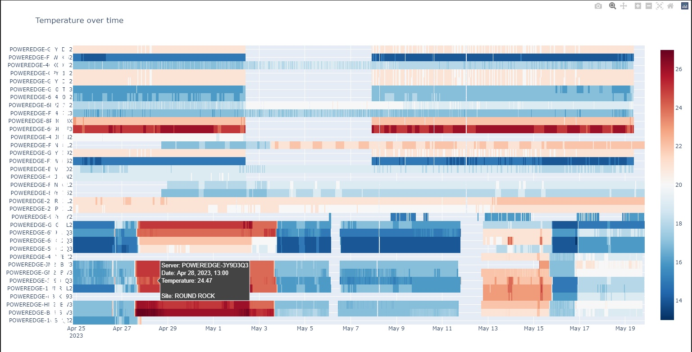

# A Beginner's Guide to Using CloudIQ REST API with Python and Jupyter
---

What if you could leverage CloudIQ observability data to extract new insights the way that you want? This guide describes how to create new use case specific visualizations and insights using Python and Jupyter.

## 1- Introduction

Over the past two years, Dell Technologies has delivered many CloudIQ capabilities to help you create and share custom reports, add custom tags to systems and objects, and integrate with other tools in your observability's ecosystem. The CloudIQ REST API allows deep integration with the tools that you use daily, automating tasks and helping you to produce the desired outcome. You can use the CloudIQ REST API to query inventory and telemetry data, create ad-hoc exports, and interface with collaboration, orchestration, ITSM or other observability tools.

In this tutorial, we focus on two specific use cases, using Python and Jupyter as our toolbelt to create custom visualizations and highlight the insights we are looking for. These use cases are:
- Creating high-level show back oriented data tables (*pandas DataFrame*) and visualizations (*Plotly treemap*) for block storage volumes
- Analyzing datacenter compute systems' temperature and identifying potential hot spot via visualizations (*Plotly heatmap*) for PowerEdge servers
We will do this by leveraging CloudIQ REST API and CloudIQ custom tags.

**Disclaimer**: The code samples in this tutorial are provided as is with no warranties. I'm a Product Manager, not a developer, so I apologize in advance for any errors in the code.

## 2- Getting started

For a high level introduction of the CloudIQ integration capabilities, please read this [blog](https://www.dell.com/fr-ca/blog/taking-devops-productivity-to-new-heights-with-aiops-automation/). This tutorial discusses leveraging a few key CloudIQ REST API endpoints. I assume you are already fluent in REST API and have some Python skills. If not, please ask your favorite DevOps colleague to help you.

The CloudIQ REST API provides read-only access to CloudIQ monitored systems' attributes and metrics, including metrics over time. CloudIQ REST API documentation is available [here](https://developer.dell.com/apis/products/analytics/cloudiq). 
In addition to the official documentation, I recommend you also leverage the **Postman collection** we provide [here](https://github.com/dell/cloudiq/tree/main/rest_api/python_tutorials). Please read this [blog] (https://www.dell.com/community/Developer-Blogs/Start-Guide-to-CloudIQ-REST-API-Using-Postman/ba-p/8375121) to use the collection.

CloudIQ REST API uses **OAuth 2.0 Client Credentials** for authentication. For security reasons, only CloudIQ users with the CloudIQ DevOps role can manage API keys, and only users with the CloudIQ Admin role can manage users and roles. Please ask your CloudIQ Admin to give you access rights if you do not have them. REST API credentials can be managed in the Admin / Integrations section of CloudIQ. You can refer to this [tutorial](https://www.dell.com/community/Developer-Blogs/Start-Guide-to-CloudIQ-REST-API-Using-Postman/ba-p/8375121) to create your CloudIQ REST API credentials.

In our examples, we cover several **CloudIQ REST API endpoints** (such as */storage_systems*, */server_systems*, */volumes*, */metrics/query*, and so on). This should give you all the information you need for your specific use cases. We will use *filter* and *select* query parameters to fetch the required data. 

Which Python environment you use is up to you. It could be Anaconda with Virtual Studio Code to start with, or something else. We will use only a few well-known libs, namely: *OAuthLib* and *Requests-OAuthlib* for data extraction, *Pandas* and *NumPy* for data transformation, and *Plotly* for data visualization.

The two **Jupyter notebooks** covered here are available from our [GitHub repository](https://github.com/dell/cloudiq/tree/main/rest_api/python_tutorials). 
Please note that one prerequisite exists to use the storage volume related notebook (*get_volumes.ipynb*), which uses some CloudIQ custom tags:
- *business_unit*
- *project*
It is easy to remove this dependency if required.

## 3- Extracting and transforming the data

Thanks to *OAuthLib* and *Requests-OAuthlib*, connecting to CloudIQ REST API is very simple: just provide your REST API Client Credentials (*client_id* and *client_secret*) in a "*.env*" file located in the same folder as the notebooks, and you should be ready to go. Please note that the example does not cover renewing the token: I left this as an exercise for the reader ;-)

To identify the API endpoints (the resources you want to access) and the available attributes and metrics, use the API documentation, leverage Postman, or both. It is usually helpful to explore the API by using Postman, because it will give you a sense of the corresponding content in responses. However, the documentation is still required to have a description of the values (including the unit for example).

To query the CloudIQ REST API and fetch systems, components and their attributes, simply do a GET to the right resources. In the *get_servers.ipynb* example we will query */server_systems*, using the '*select*' parameter to select only a subset of the attributes. It is easy to update the parameters and add a filter if required, on any attributes, including numerical values and custom tags. Note that here you may have to iterate over multiple pages for the response, if you have many instances. 

The next step is to transform the data. It is simpler if the data is available in an easy to manipulate structure, which you will have when using Pandas. In one line, you can create a *Pandas DataFrame* from the received JSON response, and use this dataframe to do exactly what you want. I encourage you to become fluent in Pandas, which is a really efficient lib to extract and manipulate data.

After fetching the main objects, now retrieve the related metrics over time (if needed). This needs some logic (which is implemented here in a set of functions) because the data set could be significant and you will have to get it in chunks (the CloudIQ REST API returning HTTP 206 / Partial Content when it has to be returned in multiple parts). As you can see in the code, to get metrics over time, you need to use a POST, so that you can pass the required arguments in the body of the POST. Those arguments are:
- *from* and *to*, in ISO 8601 format
- the *resource_type* and object *ids* you want the data for
- the *interval* for the data points, we follow the ISO 8601 standard for intervals too (e.g. PT5M means 5 minutes interval / period)
- the *metrics* you want, obviously.

Next, to discover what metrics are available, do a GET on */metric-metadata* to list them all. Here again, you can filter (using the *filter* parameter) or do a GET on a single metric to have the detailed information about it (for example, */metric-metadata/inlet_temperature_server_system*). Note that you must use the (unique) *id* here, to use the metric name when querying data over time.
Note that interval is an enum, with values: PT5M (5 minutes), PT15M (15 minutes), PT1H (1 hour), P1D (1 day). 

When your query payload is built, you can send it in JSON, as a POST, and you should receive back a JSON structure with the required data (or some of it, in case of a "Partial Content" HTTP response status code). Looping over the returned HTTP status code will allow you to fetch all the data. In our code samples, we are building the dataframe while iterating. 
Note: *tqdm* is not a mandatory lib to process the data. It is used to add a progress bar and give you a sense of the remaining calls to do to fetch all the required data.

Remember that we have daily limits and throttling policies in place, to avoid Denial Of Service (by intent or by mistake) and to give customers their fair share of calls per day. You will receive a response with HTTP code 429 if you reach the limits. If you want to go over the limits you have, please contact us. 

When you have both the object level data, and the metrics data, I personally like to de-normalize the metadata and make it available directly with the metrics / time series: it sometimes makes things simpler when manipulating visualizations.

## 4- Visualization 

This tutorial uses Plotly for visualization of the data. There are other libs available to visualize charts, but Plotly is relatively simple and flexible, with some level of user interaction with the charts. 

The main question should be: which chart to use, to highlight the insights we are looking for? And the answer is: well, it depends. For our two use cases, we will use treemap and heatmap:
- heatmap: When having multiple metrics over time, for similar objects and the same metric name, heatmap allows you to quickly identify, in a compact representation: patterns, trends, anomalies and relationships within the data.
- treemap: When looking at two metrics at a time, with some kind of hierarchy in the data (in the metadata, including CloudIQ custom tags), treemap allows you to represent the hierarchical structure by nesting rectangles, and compare metrics by using rectangles' size and color. This helps in exploring potential relationships, patterns and outliers.

I won't cover the details on how to create those Plotly charts. Please refer to the related documentation, and note that they are some subtleties in the Plotly API. 

As you can see from the below screenshot, the heatmap highlights a sudden temperature increase, for all the systems in the same datacenter. Visuals are a very powerful medium.

## 5- Code samples: Jupyter notebooks

We created two Jupyter notebooks to cover our use cases:
- *get_servers.ipynb*: to query, from CloudIQ REST API, and display, in a Plotly heatmap, PowerEdge servers' temperature over time 
- *get_volumes.ipynb*: to query, from CloudIQ REST API, and display, in a Plotly treemap, Dell storage's volumes used capacity

The main section of the notebooks are:
- the import of the libs - nothing to mention here
- the CloudIQ REST API URL to use - very simple
- the .env file with both CLIENT_ID and CLIENT_SECRET OAuth 2 Client Credentials (that you get from CloudIQ > Admin > Integration > REST API), something like:
CLIENT_ID = '<this_is_an_id>'
CLIENT_SECRET = '<this_is_a_secret>'
- the data extraction
    - authenticating first to the '*/token*' endpoint, 
    - then fetching the attributes (the metadata) related data using the right calls / resources, and creating a Dataframe (via *pd.json_normalize*)
    - then querying the metrics over time, building the POST payload for the call, and appending the responses into a Dataframe,
- the data transformation
- the data visualization
    - a treemap to show the "hierarchy" of the systems
    - a heatmap to show multiple items over time
    - a line chart for a particular system

Note that for *get_volumes.ipynb*:
- we also use hashlib to hide LUN names (in case it is a requirement),
- we create aggregations to compute used capacity at custom tags (*project* and *business_unit*) level
- we create computed KPIs (percentile 95)
- we create an advanced charts to allow you to switch between a treemap and a sunburst

## 6- Conclusion

In this tutorial, we demonstrated how to leverage the CloudIQ REST API, along with some well known tools and Python libs, to extract some specific insights from our CloudIQ observability data sets. We covered specific use cases, showing where to start, and what to do, to provide the desired outcome. We hope this was useful, and that you learned enough to get started and create your own integration with CloudIQ.

If you experience any issues using the REST API, please contact Dell support. If you have improvement requests or feedback to share with us, please use the Feedback button in the CloudIQ portal. If you want to share specific examples of integration with CloudIQ, please let us know. We will be glad to see them, and maybe ask you yo publish them in our GitHub repository and expand the CloudIQ users community!
